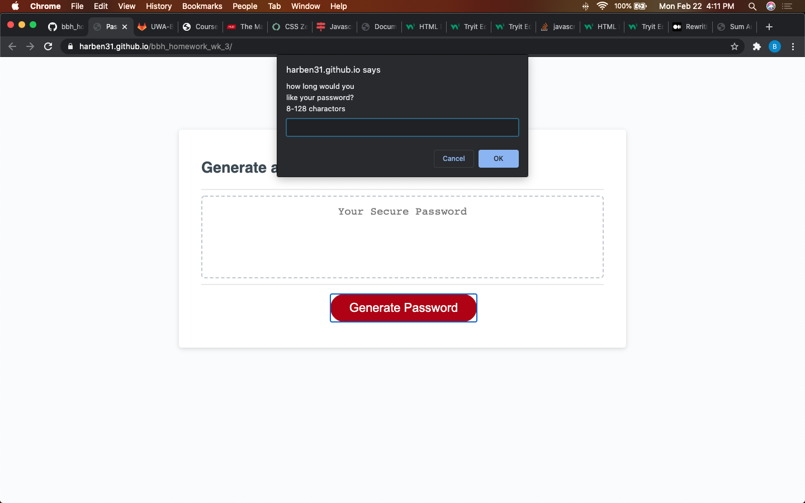
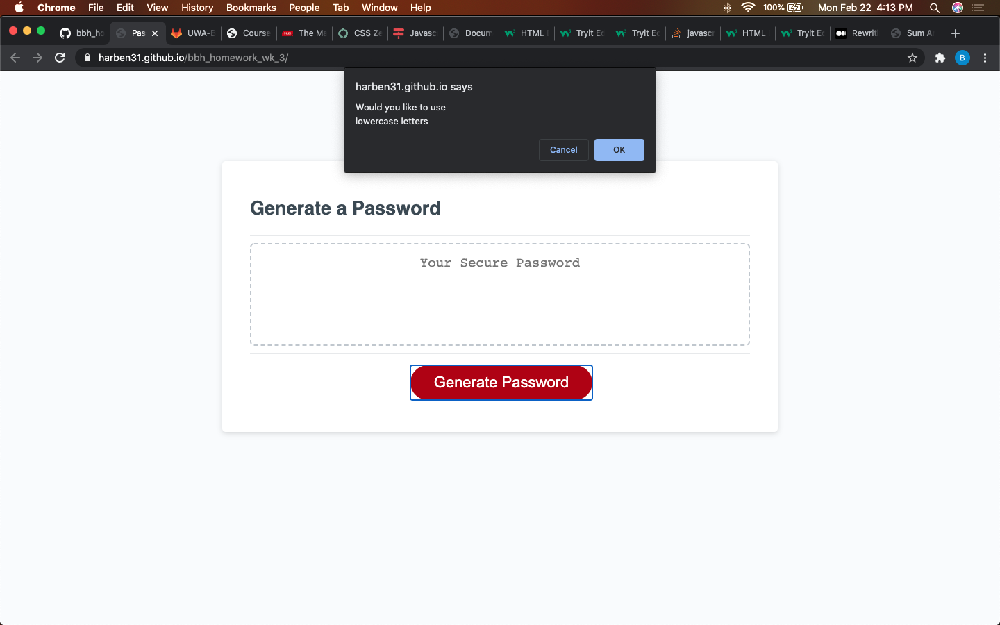
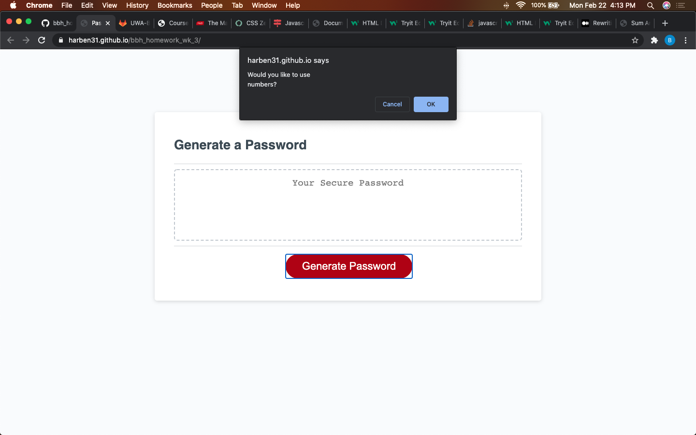
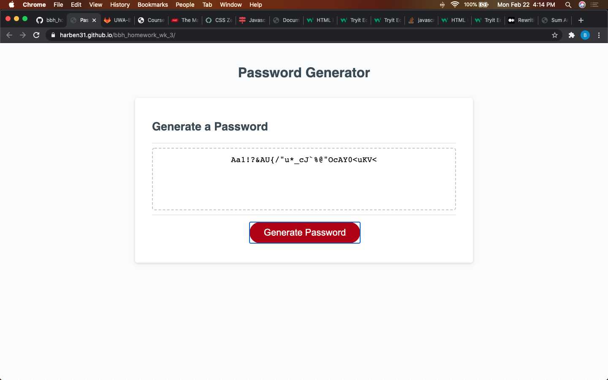

# bbh_homework_wk_3
This is a random password generator. With a prompt it will ask how many charactors you would like it. If the user cancels or puts in a value that is outside of the given length parameters the process will start over will start over.  Once the user has input an acceptable length value they will be asked via a series of confirm pop ups whether they would like to use capitol letters, lowercase letters, numbers or special symbols. The user hits OK for 'yes' and cancel for 'no'. If user selects none of these parameters the process will start over. Once one or more of the options have been selected a password the length of which is equal to the number given by the user using the chartcer sets selected by the user will appear in the box. The first one to four charactors are garuanteed charactors to ensure that at least one of each set of charactors is represented; i.e. if the user selects upper and lower case but not numbers or symbols the first two charactors of the password will be 'Aa', if all the charactor sets are selected the password will start with 'Aa1!'.

*[deployed web page](https://harben31.github.io/bbh_homework_wk_3/)

screenshots:

